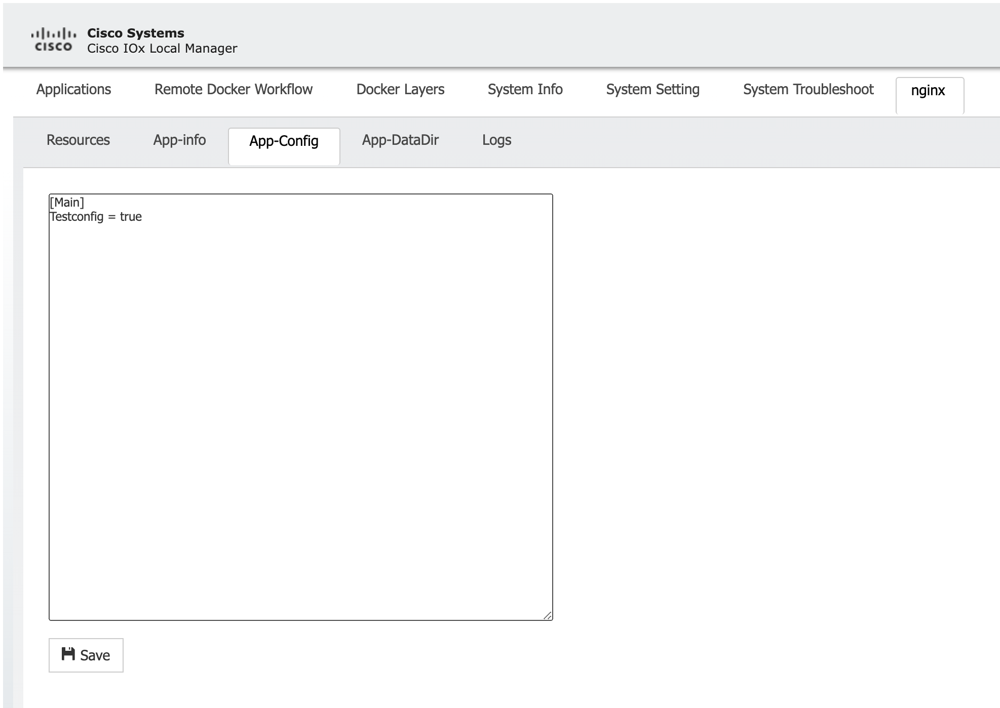
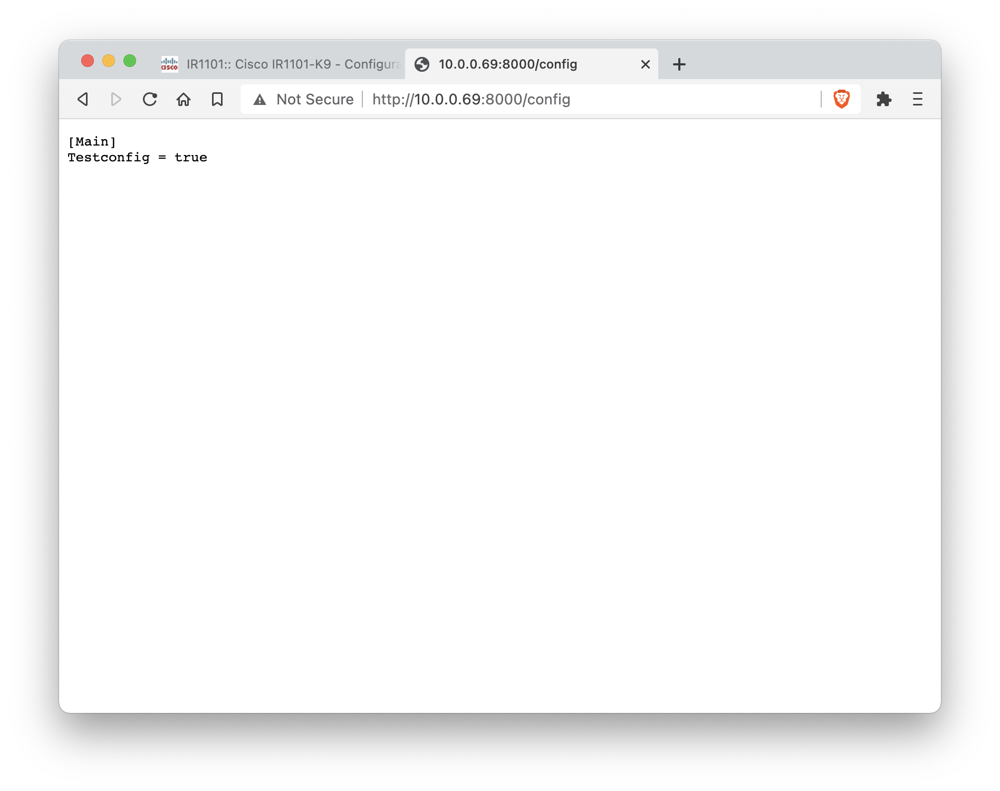
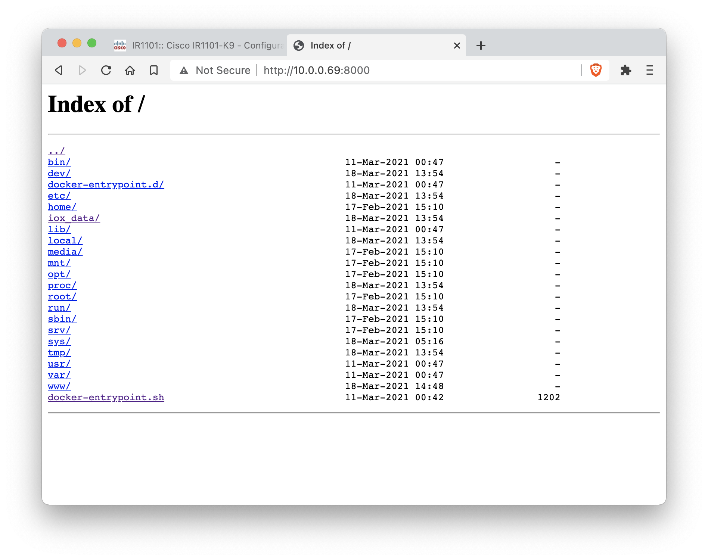

# IOx App: Nginx Webserver

With this application you can easily deploy the **NGINX web-server** on your IOx network device. Features include:

**Simple index page when visiting `http://<IP>:8000/index`**


**Change app configuration from the Local Manager and view the configuration inside the container in the browser**



**View the whole container (files and folders) inside the browser**


**View generated logs**


## Quickstart: Build & Install

Change `x86`to `ARM` below to build the app for the ARM-architecture.

```
git clone https://github.com/flopach/iox-webserver
cd iox-webserver/x86
docker build -t ioxapp .
./ioxclient docker package ioxapp .
```

The [Docker Runtime](https://www.docker.com/products/docker-desktop) and [ioxclient](https://developer.cisco.com/docs/iox/#!iox-resource-downloads/downloads) need to be installed on your computer. You can download the files via [Git](https://git-scm.com/downloads) or as ZIP (Clone or download > Download ZIP).

### 2. Installation, Configuration & Outcome

1. Install the application on your IOx device.
2. Go to `http://<IP to Container>:8000 --> filesystem of the container.

`http://<IP to Container>:8000/index` -> filesystem of the container

`http://<IP to Container>:8000/config` -> App-Config file

**Tested Hardware**

* Cisco IR1101 / IOS XE 17.4
* Cisco IC3000 / 1.2.1

## Deep-Dive: Configure the IOx App

### Differences between /ARM and /x86

IOx runs on different hardware platforms which are using different CPU architectures. For example: ARM for IR1101, x86 for IC3000 and IR829/IR809. However, with this application only 2 lines of code are different as you will see below.

> Check out the [IOx Platform Support Matrix](https://developer.cisco.com/docs/iox/#!platform-support-matrix) for more information!

**ARM-based IOx devices in folder /ARM**

Dockerfile:

```
# ARM or x86
FROM arm64v8/alpine:latest
```

package.yaml:

```
app:
  cpuarch: "aarch64"
```

**x86-based IOx devices in folder /x86**

Dockerfile:

```
# ARM or x86
FROM alpine:latest
```

package.yaml:

```
app:
  cpuarch: "x86_64"
```

### Configuration files

You can edit the configuration files:

* **Dockerfile**: Add more files to the webserver
* **nginx.conf**: Configure your nginx server
* **index.html**: Change the website running on the server and add even more files

### IOx App Networking Configuration

For the IR1101:

```
interface VirtualPortGroup0
ip address 192.168.1.1 255.255.255.0
ip nat inside
ip virtual-reassembly

interface Vlan1
ip nat outside
ip virtual-reassembly

app-hosting appid [APP_NAME]
app-vnic gateway0 virtualportgroup 0 guest-interface 0
guest-ipaddress 192.168.1.2 netmask 255.255.255.0
app-default-gateway 192.168.1.1 guest-interface 0

ip nat inside source static tcp 192.168.1.2 8000 interface Vlan1 8000
```

## Versioning

**1.0** - Added basic functionality with Nginx and working configuration file

## Authors

* **Florian Pachinger** - *Initial work* - [flopach](https://github.com/flopach)

## License

This project is licensed under the Apache License 2.0 - see the [LICENSE.md](LICENSE.md) file for details

## More Information about IOx

* Documentation: [Installation guides, app network settings & more](https://developer.cisco.com/docs/iox/)
* Learning Labs: [Step by step learning guides](https://developer.cisco.com/learning/labs/tags/IOx/page/1)
* Find more IOx Apps: [DevNet CodeExchange: IOx Apps](https://developer.cisco.com/codeexchange/platforms/iox)